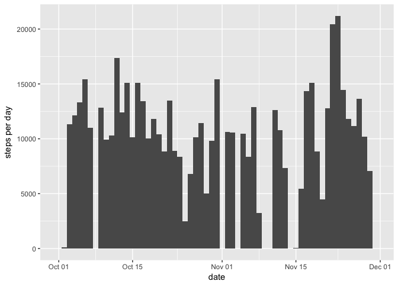
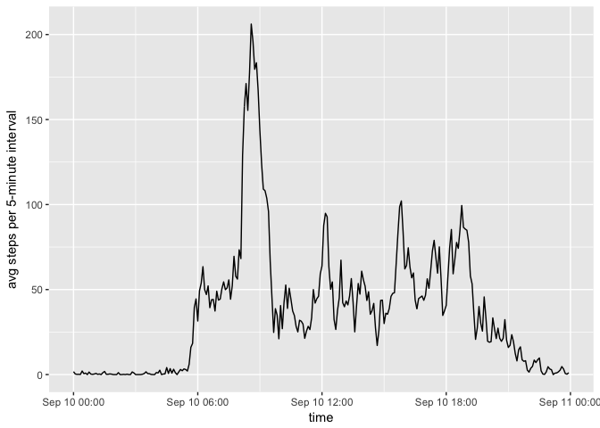
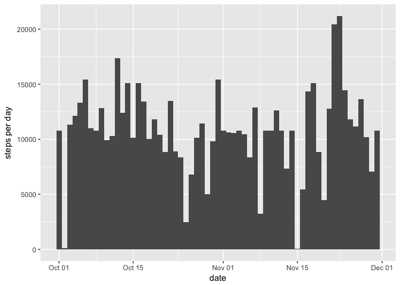
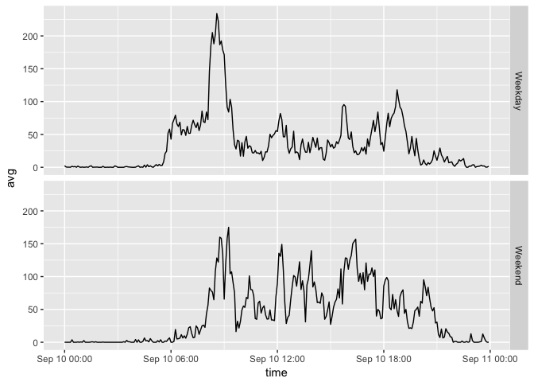

# Reproducible Research: Peer Assessment 1

## Loading and preprocessing the data

```r
library(magrittr)
library(data.table)
library(ggplot2)

csvF <- "activity.csv"
zipF <- "activity.zip"
if(!file.exists(csvF)){
  unzip(zipF)
}
activity <- read.csv(csvF) %>% data.table
activity$date <- as.Date(activity$date)
```


## What is mean total number of steps taken per day?
*Calculate the total number of steps taken per day*

```r
stepsPerDay <- activity[, .(total=sum(steps, na.rm=TRUE)), by=date]
stepsPerDay
```

```
##           date total
##  1: 2012-10-01     0
##  2: 2012-10-02   126
##  3: 2012-10-03 11352
##  4: 2012-10-04 12116
##  5: 2012-10-05 13294
##  6: 2012-10-06 15420
##  7: 2012-10-07 11015
##  8: 2012-10-08     0
##  9: 2012-10-09 12811
## 10: 2012-10-10  9900
## 11: 2012-10-11 10304
## 12: 2012-10-12 17382
## 13: 2012-10-13 12426
## 14: 2012-10-14 15098
## 15: 2012-10-15 10139
## 16: 2012-10-16 15084
## 17: 2012-10-17 13452
## 18: 2012-10-18 10056
## 19: 2012-10-19 11829
## 20: 2012-10-20 10395
## 21: 2012-10-21  8821
## 22: 2012-10-22 13460
## 23: 2012-10-23  8918
## 24: 2012-10-24  8355
## 25: 2012-10-25  2492
## 26: 2012-10-26  6778
## 27: 2012-10-27 10119
## 28: 2012-10-28 11458
## 29: 2012-10-29  5018
## 30: 2012-10-30  9819
## 31: 2012-10-31 15414
## 32: 2012-11-01     0
## 33: 2012-11-02 10600
## 34: 2012-11-03 10571
## 35: 2012-11-04     0
## 36: 2012-11-05 10439
## 37: 2012-11-06  8334
## 38: 2012-11-07 12883
## 39: 2012-11-08  3219
## 40: 2012-11-09     0
## 41: 2012-11-10     0
## 42: 2012-11-11 12608
## 43: 2012-11-12 10765
## 44: 2012-11-13  7336
## 45: 2012-11-14     0
## 46: 2012-11-15    41
## 47: 2012-11-16  5441
## 48: 2012-11-17 14339
## 49: 2012-11-18 15110
## 50: 2012-11-19  8841
## 51: 2012-11-20  4472
## 52: 2012-11-21 12787
## 53: 2012-11-22 20427
## 54: 2012-11-23 21194
## 55: 2012-11-24 14478
## 56: 2012-11-25 11834
## 57: 2012-11-26 11162
## 58: 2012-11-27 13646
## 59: 2012-11-28 10183
## 60: 2012-11-29  7047
## 61: 2012-11-30     0
##           date total
```

*If you do not understand the difference between a histogram and a barplot, research the difference between them. Make a histogram of the total number of steps taken each day*

```r
ndays <- nrow(stepsPerDay)
p <- ggplot(stepsPerDay, aes(x=date, weight=total)) + 
  geom_histogram(bins = ndays) +
  ylab("steps per day")
p
```

<!-- -->

*Calculate and report the mean and median of the total number of steps taken per day*

```r
meanPerDay <- mean(stepsPerDay$total, na.rm=TRUE)
medianPerDay <- median(stepsPerDay$total, na.rm=TRUE)
paste0("mean: ", meanPerDay, "; median: ", medianPerDay)
```

```
## [1] "mean: 9354.22950819672; median: 10395"
```


## What is the average daily activity pattern?
*Make a time series plot (i.e. type="l") of the 5-minute interval (x-axis) and the average number of steps taken, averaged across all days (y-axis)*

```r
stepsPerInterval <- activity[, .(avg=mean(steps, na.rm=TRUE)), by=interval]
# convert interval into time
hours <- stepsPerInterval$interval %/% 100
minutes <- stepsPerInterval$interval %% 100
time <- paste0(hours, ":", minutes) %>%
  strptime(format="%H:%M") %>%
  as.POSIXct()
spi <- data.table(avg=stepsPerInterval$avg, interval=stepsPerInterval$interval, time)
p <- ggplot(spi, aes(x=time, y=avg)) + 
  geom_line() +
  ylab("avg steps per 5-minute interval")
p
```

<!-- -->

*Which 5-minute interval, on average across all the days in the dataset, contains the maximum number of steps?*

```r
highestTime <- spi[avg==max(avg), time]
paste0("Max steps at ", strftime(highestTime, format="%H:%M"))
```

```
## [1] "Max steps at 08:35"
```


## Imputing missing values
*Calculate and report the total number of missing values in the dataset (i.e. the total number of rows with NAs)*

```r
paste0(nrow(activity[is.na(steps)]), " missing values")
```

```
## [1] "2304 missing values"
```

*Devise a strategy for filling in all of the missing values in the dataset. The strategy does not need to be sophisticated. For example, you could use the mean/median for that day, or the mean for that 5-minute interval, etc.*

Strategy for filling NAs: substitute NA with the mean value for that 5-min interval

*Create a new dataset that is equal to the original dataset but with the missing data filled in.*

```r
# join original data and average per interval
activityComplete <- activity[stepsPerInterval, on="interval"]
# convert steps into double to make it compatible with average
activityComplete$steps <- as.double(activityComplete$steps)
# substitute NAs with average values
activityComplete[is.na(steps), steps:=avg]
```

*Make a histogram of the total number of steps taken each day and Calculate and report the mean and median total number of steps taken per day. Do these values differ from the estimates from the first part of the assignment? What is the impact of imputing missing data on the estimates of the total daily number of steps?*

```r
stepsPerDayComplete <- activityComplete[, .(total=sum(steps)), by=date]
ndaysC <- nrow(stepsPerDayComplete)
p <- ggplot(stepsPerDayComplete, aes(x=date, weight=total)) + 
  geom_histogram(bins = ndaysC) +
  ylab("steps per day")
p
```

<!-- -->


```r
paste0("mean: ", mean(stepsPerDayComplete$total), "; median: ", median(stepsPerDayComplete$total))
```

```
## [1] "mean: 10766.1886792453; median: 10766.1886792453"
```


The mean and median are higher because NAs were weighted as 0 in the results of the first part of the assignment. In fact, a strategy that replaced 0 to NAs would have given the exact same results:

```r
activityZero <- copy(activity)
activityZero[is.na(steps), steps:=0]
stepsPerDayZero <- activityZero[, .(total=sum(steps)), by=date]
text <- paste0("mean per day without NAs: ", meanPerDay, "; median per day without NAs: ", medianPerDay, "
mean per day replacing zero: ", mean(stepsPerDayZero$total),"; median per day replacing zero: ", median(stepsPerDayZero$total))
cat(text)
```

```
## mean per day without NAs: 9354.22950819672; median per day without NAs: 10395
## mean per day replacing zero: 9354.22950819672; median per day replacing zero: 10395
```


## Are there differences in activity patterns between weekdays and weekends?
*Create a new factor variable in the dataset with two levels – “weekday” and “weekend” indicating whether a given date is a weekday or weekend day.*

```r
activity$dayType <- sapply(activity$date, function(d){
  ifelse(weekdays(d) %in% c("Saturday", "Sunday"), "Weekend", "Weekday")
})
activity$dayType <- factor(activity$dayType)
```

*Make a panel plot containing a time series plot (i.e. type="l") of the 5-minute interval (x-axis) and the average number of steps taken, averaged across all weekday days or weekend days (y-axis). See the README file in the GitHub repository to see an example of what this plot should look like using simulated data.*

```r
stepsPerInterval <- activity[, .(avg=mean(steps, na.rm=TRUE)), by=.(interval, dayType)]
# convert interval into time
hours <- stepsPerInterval$interval %/% 100
minutes <- stepsPerInterval$interval %% 100
time <- paste0(hours, ":", minutes) %>%
  strptime(format="%H:%M") %>%
  as.POSIXct()
spi <- data.table(avg=stepsPerInterval$avg, interval=stepsPerInterval$interval, dayType=stepsPerInterval$dayType, time)
p <- ggplot(spi, aes(time, avg)) + geom_line()
p + facet_grid(dayType ~ .)
```

<!-- -->


